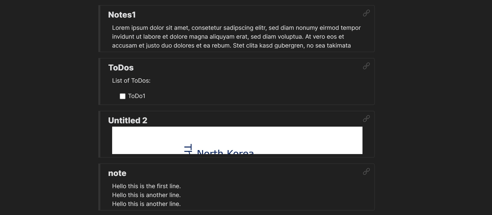

## zblock-notes-list

Plugin for [Obsidian](https://obsidian.md/). List notes with a preview of their content like a note taking mobile app.



<br>

## How to use

Insert a "zblockNotes" codeblock in your note.  
 Like so:

````
    ```zblockNotes
    ```
````

You can also set a limit for the number of notes to be displayed. The default is 10!  
Just insert a number inside the codeblock. If you want all your notes to be displayed just add a high number.
Example:

````
    ```zblockNotes
    5
    ```
````

The notes get sortet by last modified.  
Depending on the content of the note, the preview can look a bit quirky (see example pic above).

<br>

> WARNING  
> Displaying too many notes can cause lag or a crash.  
> Same goes for too many notes that have a lot of other embedded notes inside.

<br>

## Manually installing the plugin

-   Copy over `main.js`, `styles.css`, `manifest.json` to your vault `VaultFolder/.obsidian/plugins/zblock-notes-list/`. Found under [Releases](https://github.com/patrikglanemann/zblock-notes-list/releases).
